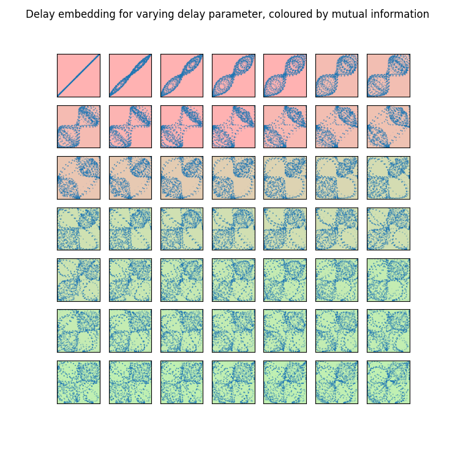
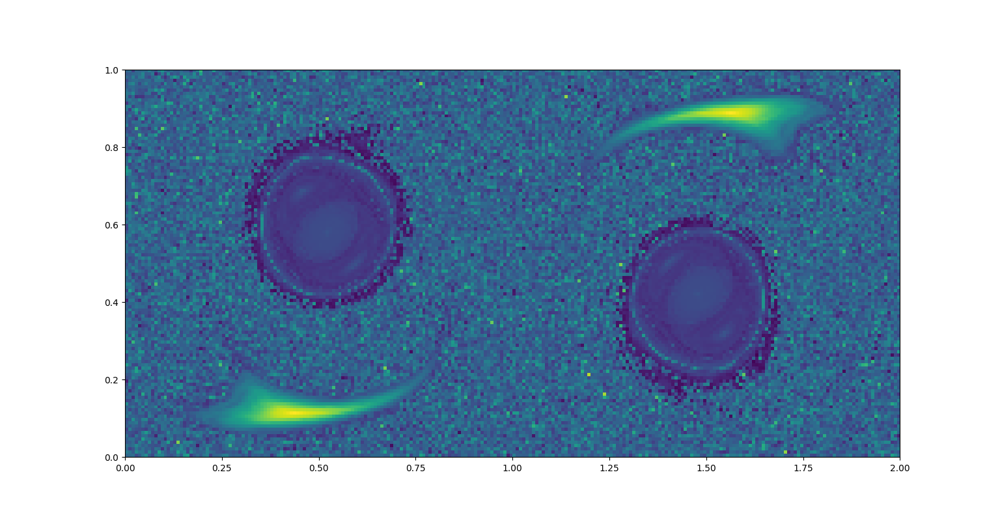
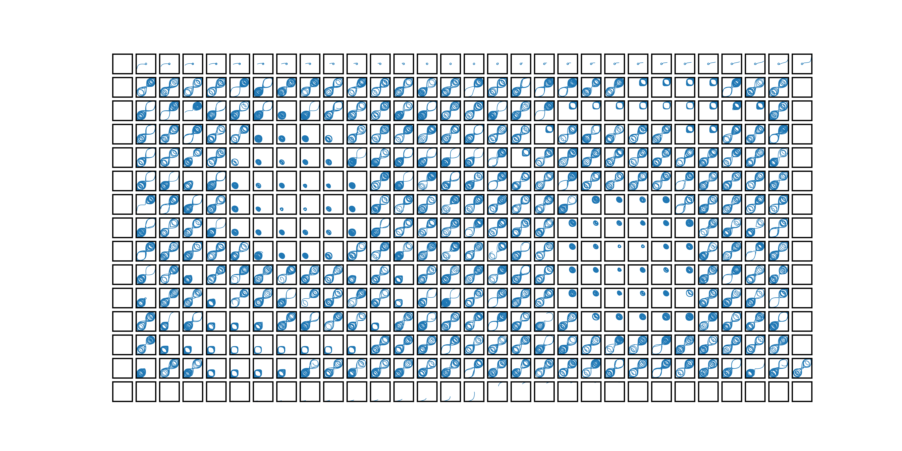

# <p align="center">An investigation into classification of initial conditions of dynamical systems using persistent homology</p>

### <p align="center">Adam Cutts</p>

---
Many thanks to my supervisor Ximena Fernandez at Oxford's Mathematical Institute for her helpful guidance and feedback throughout this project.

---
## Introduction
A continuous time dynamical system conists of a state space $X$, typically some subset of $`\mathbb{R}^n`$, along with some $C^1$ function $f$. The system then evolves according to the ODE $\dot{x} = f(x)$, where $x\in X$. Such systems can be thought of as a vector field imposed on the state space $X$. 

The long-run dynamics of such systems is of great interest. In practice, one wants to characterise the evolution of a state from some initial state $x_0$. For instance, will that state evolve under the action of $f$ in a periodic manner? Will the state stabilise to some fixed value? Will it blow up in an unbounded way? 

Such questions are trivial to analyse in low dimensions. For instance, if $X$ is 1-dimensional, no periodic orbits can exist; either states stabilise to a fixed point or they blow up to $\pm \infty$. See chapter 2.6 of [^1] for more on this. The situation gets more complicated the higher the dimension of the state space $X$. In these cases, we are no longer interested just in fixed points, but in attractors, that is sets of points towards which nearby states evolve. 

This code explores categorising the long-run dynamics of a dynamical system by exploring the topology of its attractors. Following along the lines of [^2], we investigate the so-called double-gyre system. However, where [^2] explores the BraMAH approach, we instead seek to use the tools of persistent homology [^3].

---
## Setup
The double-gyre system models oscillating jets of water in 2-dimensions. It has the advantage that the domain of definition is invariant in the sense that the vector field has 0 normal component at the boundary. It is defined on the state space $[0,2]\times [0,1]$, with the following vector field: 
```math
\begin{align}
v_x&=-\pi A \sin (\pi f(x,t)) \cos (\pi y) \\
v_y&=\pi A \cos(\pi f(x,t)) \sin(\pi y) (2a(t)x + b(t)).
\end{align}
```
Here we use $a(t)= \epsilon \sin(\omega t)$, $b(t)= 1 - 2\epsilon\sin(\omega t)$, $f(x,t) = a(t) x^2 + b(t) x$. The constants we choose are $A = \epsilon = 0.1$ and $\omega = \pi /5$. Note that this gives the vector field a time-period of 10. In the file `double_gyre.py` this vector field is defined, along with a function to simulate trajectories from an initial point.

A key tool in analysing the topology of the attractors of our system is Takens' delay embedding theorem. This theorem establishes fairly weak conditions under which a diffeomorphic copy of the attractor can be recovered from a so-called delay embedding. Roughly speaking, a delay embedding takes some scalar-valued function of a trajectory, say the x-coordinate, as a function of time. Let's call this function the observation function $s:[t_0, t_1] \to R$.

The delay embedding with dimension $d$ and delay $T$ is then the map $s_{del} : [t_0, t_1 - dT] \to R$ given by 
```math
s_{del}(t) = (s(t), s(t+T), \ldots, s(t+dT)).
```
This embedding transformation is encoded in the file `delay_embedding.py`.

The essential idea is: 
1. find 'good' parameters $d$ and $T$ for the delay embedding;
2. simulate the dynamics for a grid of initial positions;
3. calculate Takens' delay embedding for each point, returning a point cloud;
4. calculate the persistence barcodes (see section below) for each point cloud;
5. plot relevant statistics from the barcodes.

## Parameter selection
In order to compare the persistence barcodes between two initial points, we must select global values of the parameters $d$ and $T$ used in the delay embedding. Deciding on these parameters, especially in such a global way, presents a significant challenge. The higher we choose the dimension $d$, the more information we capture, but the slower the computation of topological properties from the resultant point clouds. Takens' delay embedding theorem states that any dimension greater than twice the box-counting dimension [^4] of the underlying attractor suffices; often this is a pessimistic estimate. Possible heuristics include the False Nearest Neighbour criterion; see [^5].

In the code, we opt for $d=4$. It provides sufficient detail to differentiate periodic and quasi-periodic trajectories.

Also in [^5], the authors suggest using mutual information as a tool to find 'nice' values of the delay parameter. Mutual information roughly measures how dependent two measurements are. If the mutual information between the array of undelayed data $s(t_0), s(t_0 +h), \ldots$ and delayed data $s(t_0 + T), s(t_0 + h +T), \ldots$ is $0$, then these two observations are independent. In that case, plotting the undelayed observation against the delayed observation provides significant information about the dynamics. This avoids situations like a delay of $T=0$: clearly the delayed data is then equal to the undelayed data, so is highly dependent.

Specifically, [^5] suggests to increase $T$ until the first local minimum of mutual information is found. The file `mutual_info_test.py` explores this idea, plotting the delay embedding with dimension 2 for various values of the delay $T$. An example of such a plot is listed below. The colour represents the mutual information; red is high, green is low.



## Persistence barcodes
At this stage, we can calculate Takens' embedding for each initial point in the state space $[0, 2] \times [0, 1]$. The topology of the embedding is investigated using homology. Roughly speaking, homology characterises the amount of 'n-dimensional holes' in a topological space, for positive integers n. Point clouds themselves are not topologically interesting; however, thickening each point the ball of radius $\epsilon$ can give more interesting topological spaces, that provide a good model for the 'real' topology of the point cloud. Choosing a good representative scale $\epsilon$ is a difficult task.

The idea of persistent homology is to consider the homology of the $\epsilon$-thickening over a range of values of $\epsilon$. This returns an object called a persistence barcode. For more information see [^3].

The Ripser package in Python gives a fast way to compute these barcodes. In `persistence_grid_length.py` is the file for computing the persistence barcodes of the delay embedding for each initial point, along with plotting a chosen statistic of these barcodes.

## Results
Here is the resultant plot, where the length of the longest barcode is chosen as the relevant statistic.



There is no legend here, but (using the viridis colour map from matplotlib) yellow corresponds to long longest bars (i.e. a cycle at a large range of scales) and dark blue corresponds to a short longest bar.

It's worth comparing this plot to a plot of the delay embedding at various points in the grid. We see regions of different types of trajectories:



## Conclusion
The plot is surprisingly pretty and interesting in its own right. Firstly, it exhibits the rotational symmetry of the vector field. It also splits the phase space into three distint regions:

1. comets in the lower left and upper right, of consistent high value of the length of the longest bar;
2. round blobs of low value in the upper left and lower right;
3. noise elsewhere.

The reason why this is suprising is that the length of the longest bar in the persistence barcode isn't a priori a very interesting statistic. In fact, it was chosen arbitrarily as a simple and quick to compute value. 

The noise (and lack thereof in regions 1. and 2.) is interesting from a chaos theory perspective: if the persistence barcodes do indeed provide good representations of the topology of the underlying attractors, and the system is chaotic, then this noise is in some sense inevitable.

More insightful statistics are a potential next avenue for this research. In [^6] various vectorisation methods for persistence barcodes are discussed. This paper suggests the so-called 'persistence statistics' provide a good vector representation of barcodes, in the sense of machine learning features. 

Another avenue worth pursuing is generating plots with more than one feature in mind. In fact, RGB space has the advantage of being a 3-dimensional space, allowing up to three features to be meaningfully plotted at once. This has great potential to provide even more ways to visually separate the state space.

---
## References
[^1]: Steven H. Strogatz. "Nonlinear Dynamics and Chaos", 1994 
[^2]: Charó, Gisela D., Guillermo Artana, and Denisse Sciamarella. "Topology of dynamical reconstructions from Lagrangian data". Physica D: Nonlinear Phenomena 405 (2020): 132371, 2020
[^3]: Gunnar Carlsson. "Topology and Data". American Mathematical Society. S 0273-0979(09)01249-X, 2009
[^4]: Florens Takens. 
[^5]: https://giotto-ai.github.io/gtda-docs/0.5.1/notebooks/topology_time_series.html#picking-the-embedding-dimension-and-time-delay
[^6]: 
